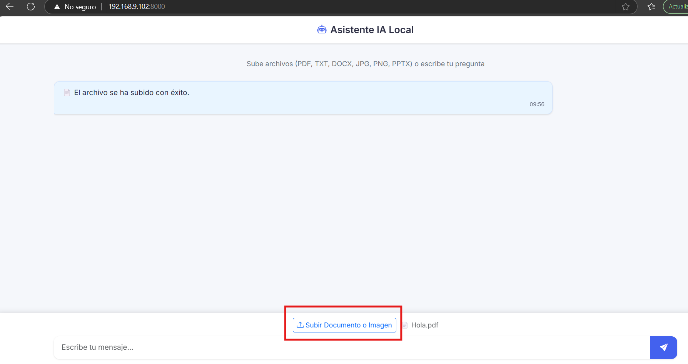
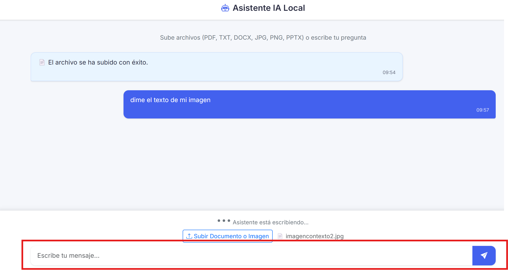

# Proyecto de Chat Inteligente con IA Local

Este proyecto permite la interacción con un modelo de lenguaje (IA) local a través de una API basada en **FastAPI**. La aplicación está dividida en dos carpetas principales:

- **app**: Contiene el servidor de que expone el endpoint para interactuar con el modelo de IA.
- **script/**: Contiene el script cliente que se conecta con la APP y permite al usuario interactuar con el modelo.

## Estructura del Proyecto
```bash
├── app.py # Servidor FastAPI 
├── requirements.txt # Dependencias para la API 
├── templates/ # Plantillas HTML (si es necesario) 
├── static/ # Archivos estáticos (CSS, JS, imágenes) 
├── ... # Otros archivos relacionados con la API 
├── script/ # Carpeta con el script cliente 
├── script.py # Script que interactúa con la API 
├── requirements.txt # Dependencias del script 
└── README.md # Este archivo
```
## Descripción

### APP

El archivo app.py contiene el servidor **FastAPI** que expone un endpoint para interactuar con un modelo de IA local de forma local y via interfaz web. El modelo es accesible a través de un endpoint POST que recibe un **prompt** y, opcionalmente, un archivo, y devuelve una respuesta generada por el modelo.

Tiene un historial de hasta 4 mensajes.

#### Archivos principales:

- **app.py**: Contiene la definición del servidor FastAPI, incluyendo los endpoints para cargar archivos y generar respuestas con el modelo de IA.
- **requirements.txt**: Lista las dependencias necesarias para ejecutar la API, como `fastapi`, `uvicorn`, y otras librerías para procesamiento de documentos y generación de texto.
- **templates/**: Contiene las plantillas HTML utilizadas por la API (si es necesario para la interfaz web).
- **static/**: Archivos estáticos como imágenes, CSS o JavaScript (si es necesario). **Si no aparece hay que crearla**
- **script/**: Contiene el script cliente que permite al usuario interactuar con la API de generación de texto. Este script solicita al usuario una pregunta, y opcionalmente permite subir un archivo para que el modelo lo procese y genere una respuesta basada en el contenido del archivo o el prompt proporcionado.

#### Archivos principales en la carpeta `script`:

- **script.py**: Es el script que se ejecuta para interactuar con la API, enviar solicitudes de generación de texto y mostrar las respuestas generadas.
- **requirements.txt**: Lista las dependencias necesarias para ejecutar el script cliente, por si tienes el servidor activo en otra maquina y solo quieres usar el script.

## Instrucciones de Uso

### 1. Configuración del Entorno (Puedes saltarte este paso si solo quieres usar el `script`)

Para comenzar a usar el proyecto, debes instalar las dependencias necesarias tanto para la APP.

También debes instalar un modelo de IA:
1. Primero debes instalar [Ollama](https://ollama.com/).
2. Después de terminar la instalación te descargas el modelo de IA. El modelo de ejemplo será gemma3:12b.
```bash
ollama pull gemma3:12b
```
3. Esperas a que se instale y después ejecutas esto:
```bash
ollama run gemma3:12b
```
Finalmente puedes utilizar la IA de manera local. Para dejar de usarlar pon `/bye` o Ctrl + d.

#### Para la APP: (Puedes saltarte este paso si solo quieres usar el `script`)

1. Tener instalado ollama con el modelo que se este usando, en este caso llama3.
2.  Clona el repositorio:
    ```bash
    git clone git@github.com:agutcan/chatModeloLLM.git
    ```
3. Navega a la carpeta `chatModeloLLM/`:
   ```bash
   cd chatModeloLLM
   ``` 
4. Crea un entorno virtual:
   ```bash
   python -m venv .venv
   ``` 
5. Activa el entorno virtual:
   ```bash
   source .venv/Scripts/activate
   ```
6. Instala las dependencias:
    ```bash
   pip install -r requirements.txt
   ```
7. Modifica la URL a donde este el servidor con la api en el archivo `index.html`:
    ```html
   try {
      const response = await fetch('http://192.168.9.102:8000/generate', { // Cambia la url si es necesario
         method: 'POST',
         headers: { 'Content-Type': 'application/json' },
         body: JSON.stringify({
               prompt: message,
               file_text: file_text,
               file_name: file_name,
               file_type: file_type
         }),
         credentials: 'include'
      });
   ```
   ```html
   try {
      let response = await fetch("http://192.168.9.102:8000/upload_file", { // Cambia la url si es necesario
         method: "POST",
         body: formData
   });
   ```
8. Escribe el siguiente comando para ejecutar la API
   ```bash
   python app.py
   ```
   Debería salirte algo así
   ```bash
   INFO:     Started server process [20544]
   INFO:     Waiting for application startup.
   INFO:     Application startup complete.
   INFO:     Uvicorn running on http://0.0.0.0:8000 (Press CTRL+C to quit)
   ```
   Esto significa que está funcionando

#### Para la APP:

1. Clona el repositorio:
    ```bash
    git clone git@github.com:agutcan/chatModeloLLM.git
    ```
2. Navega a la carpeta `chatModeloLLM/script/`:
   ```bash
   cd chatModeloLLM/script/
   ``` 
3. Crea un entorno virtual:
   ```bash
   python -m venv .venv
   ``` 
4. Activa el entorno virtual:
   ```bash
   source .venv/Scripts/activate
   ```
5. Actualiza pip:
   ```bash
   python -m pip install --upgrade pip
   ```
6. Instala las dependencias:
    ```bash
   pip install -r requirements.txt
   ```
7. Modifica la URL a donde este el servidor con la api:
    ```python
    API_BASE_URL = "http://192.168.9.102:8000"  # Cambia esto si tu API está en otro lugar
   ```
8. Ejecuta el script:
    ```bash
   python script.py
   ```
9. Ejemplo de uso:
   ```bash
    --- Generador de respuestas con IA ---
    Escribe tu pregunta (o 'salir' para terminar):
    > Hola, como estas?
    Desea subir un archivo PDF, TXT, DOCX, PPTX, XLSX, PNG o JPG (Y/N): n

    Generando respuesta...


    Respuesta:
    Hola! Estoy bien, gracias. ¿Y tú?

    Tiempo de respuesta: 15.27 segundos
   ```

#### Para usar la app via interfaz web:

1. Accede a la [url](http://192.168.9.102:8000)
 del endpoint desde tu navegador:
   
2. Si deseas subir un archivo, subelo de la siguiente manera, pulsa en el botón de "Subir documento o Imagen" y cuando salga un mensaje de confirmación puedes hacer la pregunta:
   
3. Manda un mensaje al asistente:
   
